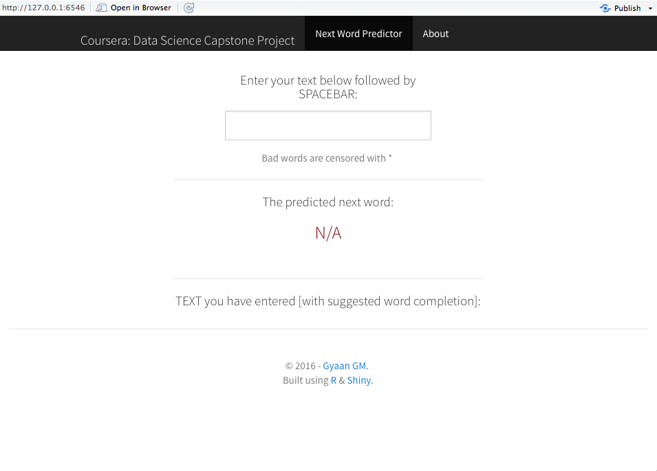
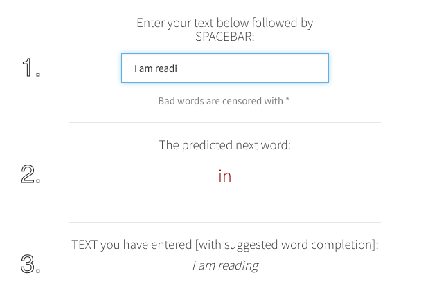

Coursera: Data Science
=============================================
A presentation on Capstone Project "PredictNextWord"

By Dilip Singh Kunwar [May 28, 2016]

Introduction
========================================================

<small> The Coursera Data Science Specialization Capstone Project from Johns Hopkins University (JHU) allows 
students to create a usable public data product that can show their skills to potential 
employers. For this iteration of the class, JHU partnered with SwiftKey 
(http://swiftkey.com/en/) to apply data science in the area of **Natural Language Processing**.

The objective of this project is to build a working predictive text model. The data used in the 
model came from a **corpus** called HC Corpora (www.corpora.heliohost.org). A corpus is body of text, 
usually containing a large number of sentences. [1]

<small>[1] http://desilinguist.org/pdf/crossroads.pdf</small></small>

Algorithm
========================================================

<small>The algorithm developed to predict the next word in a user-entered text string was based on a 
classic **N-gram** model. [2] Using a subset of cleaned data from blogs, twitter, and news 
Internet files, **Maximum Likelihood Estimation** (MLE) of unigrams, bigrams, and trigrams were computed.

To improve accuracy, **Jelinek-Mercer smoothing** was used in the algorithm, combining 
trigram, bigram, and unigram probabilities. [3] Where interpolation failed, 
**part-of-speech tagging** (POST) was employed to provide default predictions by part of 
speech. [4] Suggested word completion was based on the unigrams. A profanity filter was also utilized 
on all output using Google's bad words list. [5]</small>

<small>[2] http://en.wikipedia.org/wiki/N-gram</small>
<small>[3] http://www.ee.columbia.edu/~stanchen/papers/h015l.final.pdf</small>
<small>[4] http://en.wikipedia.org/wiki/Part-of-speech_tagging</small>
<small>[5] https://badwordslist.googlecode.com/files/badwords.txt</small></small>

Shiny App
========================================================

<small> Then a Shiny (http://shiny.rstudio.com/) app that accepts a 
phrase as input, suggests word completion from the unigrams, and predicts the most likely next word based 
on the linear interpolation of trigrams, bigrams, and unigrams is developed. The web-based application can be found <a href="https://gkgm.shinyapps.io/PredictNextWord/"> here</a> and the source files for this project can be found <a href="https://github.com/dskunwar/Capstone_Milestone_Project"> here</a>. App user interface looks like this </small>

How to use App
========================================================
<small>
<i>The user interface of this application works as follows: </i>  
When the text [**1**] is entered, the field with the predicted next word [**2**] refreshes instantaneously and  also the whole text input [**3**] gets displayed with suggested completion work as shown below in the diagram.
</small>

